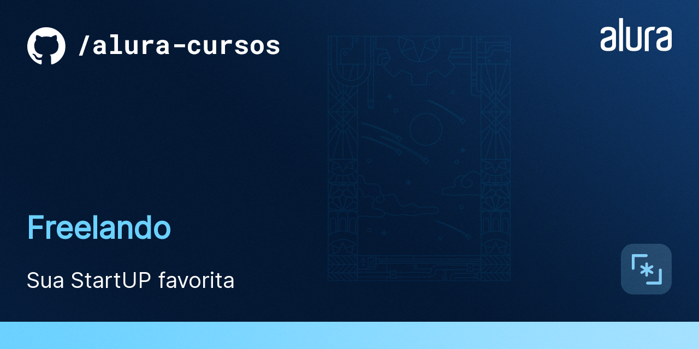
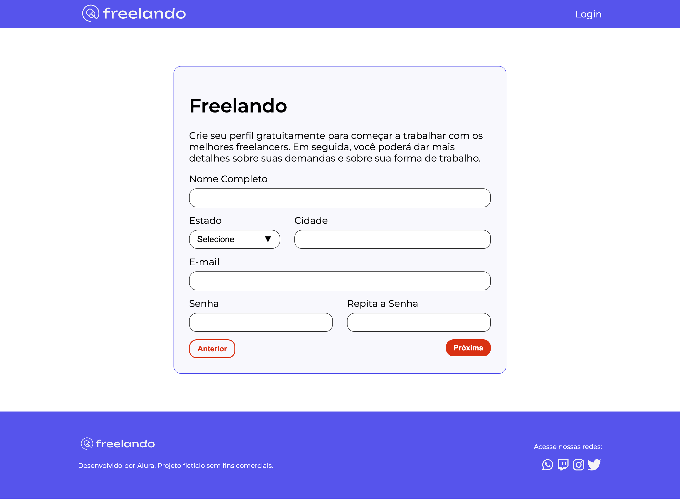

# Freelando

O Freelando é uma StartUP. 
Nesse momento, é um MVP que tá só começando e ainda tem muitas funcionalidades novas para serem desenvolvidas.

## 🔨 Funcionalidades do projeto

Nesse primeiro momento, nós temos a página que foi idealizada como a primeiro entrega do time de desenvolvimento.

O [Figma dessa aplicação você encontra aqui](https://www.figma.com/file/DGIzbfXEi27oiKzI0nGMIV/Freelando-%7C-WebApp-com-React?node-id=244%3A11524&t=J2NfqHrvVIr0jsgs-0).

## ✔️ Técnicas e tecnologias utilizadas

Se liga nessa lista de tudo que usaremos nesse curso:

- `React`
- `Create React App`
- `Emotion`
- `React Grid System`
- `Eventos do Teclado`
- `GitHub`
- `Trello`
- `Figma`

E muito mais!

## 🛠️ Abrir e rodar o projeto

Para abrir e rodar o projeto, execute `npm i` para instalar as dependências e `npm start` para inicar o projeto.

Depois, acesse <a href="http://localhost:3000/">http://localhost:3000/</a> no seu navegador.

## 📚 Mais informações do curso

O Freelando é uma StartUP fictícia utilizada nesse curso da Alura.
A ideia principal desse curso é evoluir ainda mais os conhecimentos em React e estilização de componentes.# react-vite-authentication-token
